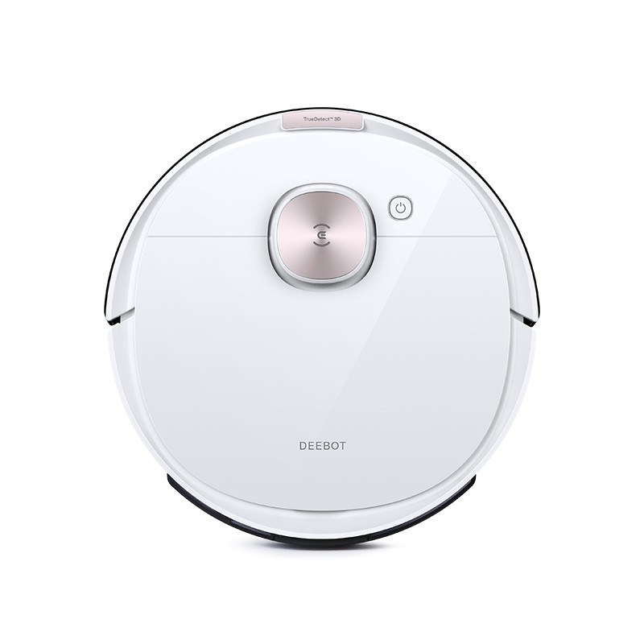

# Deebot T8

Yet another Deebot client library, intended to bring better support to Ozmo T8 range of robots.

<p align="center">

</p>

## Supported Robots

* Ecovacs Deebot Ozmo T8 (Model: OT8G)

Other Deebot Ozmo T8 variant robots will likely also work, but have not been tested. Please open an issue if you have success with other models 😊 

Models can be listed using the CLI: `./deebot-t8 list-devices`

## Features

* Always up to date state using Ecovacs MQTT service
* Fully featured command line interface
* Extenable interface, with abstractions hiding ugly HTTP necessities

## Install

To install the base library for use in other Python projects:

```
pip install deebot-t8
```

To install the base library, as well as the CLI:

```
pip install deebot-t8[cli]
```

The package exposes the cli as a `deebot-t8` executable binary.

```sh
$> deebot-t8 --help
Usage: deebot-t8 [OPTIONS] COMMAND [ARGS]...

Options:
  --config-file PATH
  --help              Show this message and exit.

Commands:
  device
  list-devices
  login
  renew-access-tokens
```

## TODO

* Handle error and offline cases
* Support for building a map image using map received map data in real time

## Special Thanks

* [mitmproxy](https://mitmproxy.org/) for reverse engineering HTTP(s) calls from the iOS app
* https://github.com/And3rsL/Deebotozmo and https://github.com/wpietri/sucks for protocol details for authentication
* https://github.com/Ligio/ozmo for inspiring and guiding the MQTT subscription implementation

## Contributing

I am more than happy to receive pull requests to add support for missing or broken features. Bug reports via issues also welcome, however is no guarantee of the bug being resolved

As this library is intended to be narrow focused on the Deebot T8 line, depending on the complexity burden, pull requests to support additional robots may be rejected. 
